

  

<h1 align="center">presencIA</h1>

<h3 align="center">Agencia digital con IA · Lago de Atitlán</h3>

  <strong>Nos encargamos de todo. Tú, de atender.</strong> 
  Que te encuentren — y que reserven directamente contigo. Web profesional bilingüe, un reparto de agentes IA
  que responde en tu sitio, por teléfono y por WhatsApp, redes, WiFi que capta leads, reseñas y SEO · AEO.

  
  
  
  

  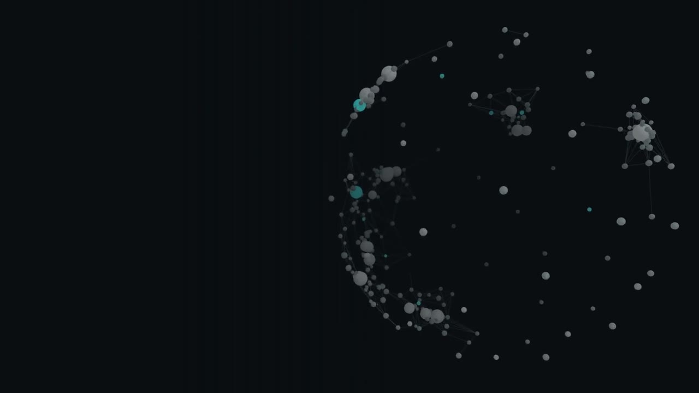

---

## Por qué existe

Un negocio en Guatemala pierde clientes por tres motivos: no lo encuentran, no confían o no logran reservar.
En las horas que tarda en llegar la primera respuesta, el cliente ya escribió a otro. presencIA junta en un solo
equipo lo que normalmente requiere una agencia, un community manager y una recepcionista — y lo hace con IA
que trabaja **24/7, festivos incluidos, en 110 idiomas**.

Somos parte de **[Intuit AI](https://github.com/MGEncrypted)**: los mismos productos que operan en Italia con
[agentemia.it](https://agentemia.it), adaptados al mercado guatemalteco.

---

## Lo que hacemos por ti

Seis servicios, un solo equipo, una sola factura. Contratas el Plan Base y sumas los módulos que necesites.

<table align="center">
<tr>
<td align="center" width="33%">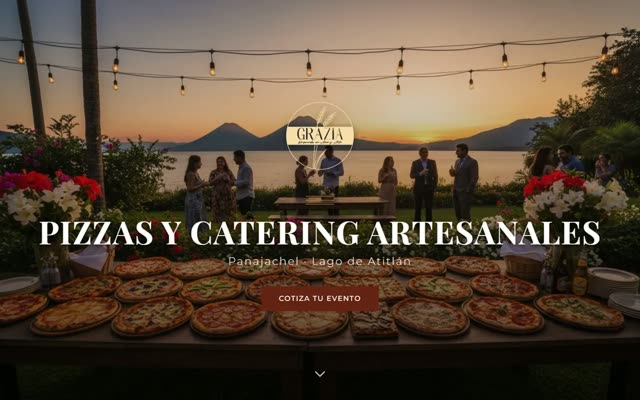 <strong>01 · Página Web Profesional</strong> · Plan Base Tu sitio publicado en menos de 7 días. Bilingüe ES/EN, optimizado para Google, hosting + SSL incluidos.</td>
<td align="center" width="33%">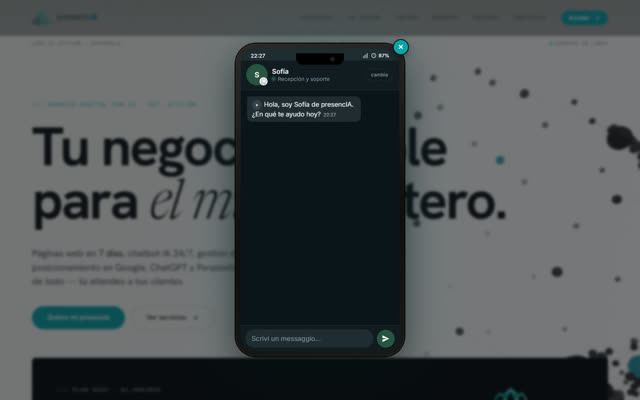 <strong>02 · Reparto Front-Office AI</strong> · Plan Base Cinco agentes que capturan, califican, agendan y escalan — en tu web y, a pedido, WhatsApp y Facebook.</td>
<td align="center" width="33%"> <strong>03 · Presencia en Redes Sociales</strong> · Standalone Instagram y Facebook completos: 8–12 posts/mes, diseño, copy, respuesta a comentarios y DMs.</td>
</tr>
<tr>
<td align="center" width="33%">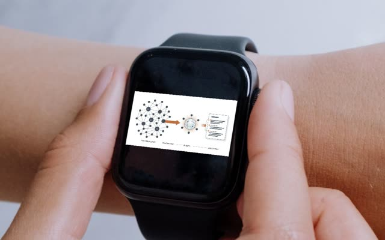 <strong>04 · Smart WiFi + Captación de Leads</strong> · Add-on Tu WiFi se vuelve una máquina de marketing: cada cliente que se conecta deja su correo, y esa lista trabaja sola.</td>
<td align="center" width="33%">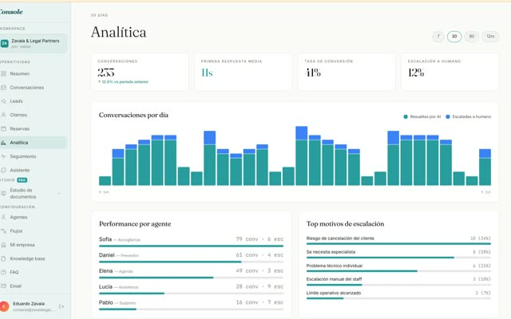 <strong>05 · Review Shield — Reputación Online</strong> · Add-on Las reseñas positivas se publican solas; las negativas pasan primero por nosotros. Respuesta en 24 h.</td>
<td align="center" width="33%">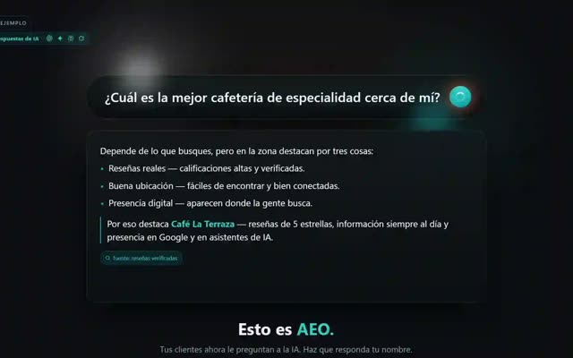 <strong>06 · SEO + AEO · Visibilidad IA</strong> · Add-on Apareces donde buscan hoy: Google y los asistentes de IA. Que ChatGPT, Perplexity y Claude citen tu negocio.</td>
</tr>
</table>

---

## El equipo de IA — cinco agentes con nombre propio

<table align="center">
<tr>
<td align="center" width="120"> <strong>Sofía</strong> Recepción &amp; soporte</td>
<td align="center" width="120"> <strong>Daniel</strong> Calificación de leads</td>
<td align="center" width="120"> <strong>Lucía</strong> Retención &amp; CS</td>
<td align="center" width="120"> <strong>Pablo</strong> Soporte técnico</td>
<td align="center" width="120"> <strong>Elena</strong> Agenda &amp; citas</td>
</tr>
</table>

Tres pilares: **Velocidad** (respuesta en 11 segundos, frente a una media del sector de 42 horas),
**Verticalidad** (entrenado en tu sector, con tus documentos — no respuestas genéricas) y
**Verdad** (sin letra pequeña: cada conversación y cada costo, visible en tu consola). Si el agente no sabe,
lo dice y pasa a un humano.

  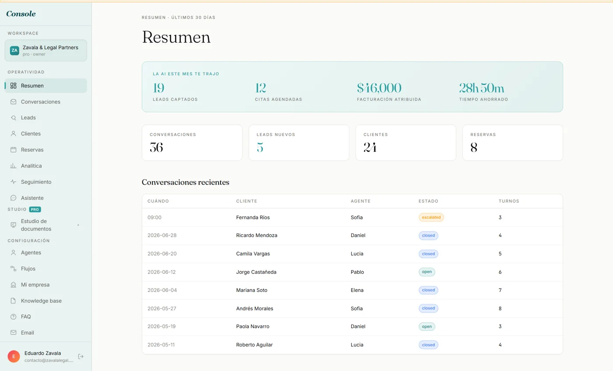

La consola: funnel de leads, todas las conversaciones (web, teléfono, WhatsApp) en una sola bandeja, costos en tiempo real, agenda y base de conocimiento.

---

## Lo que creamos

Cada página tiene su propio motor gráfico. Ninguna plantilla se repite.

<table align="center">
<tr>
<td align="center" width="25%"> <strong>Grazia</strong> · restaurante, Panajachel</td>
<td align="center" width="25%"><a href="https://psycho.lat">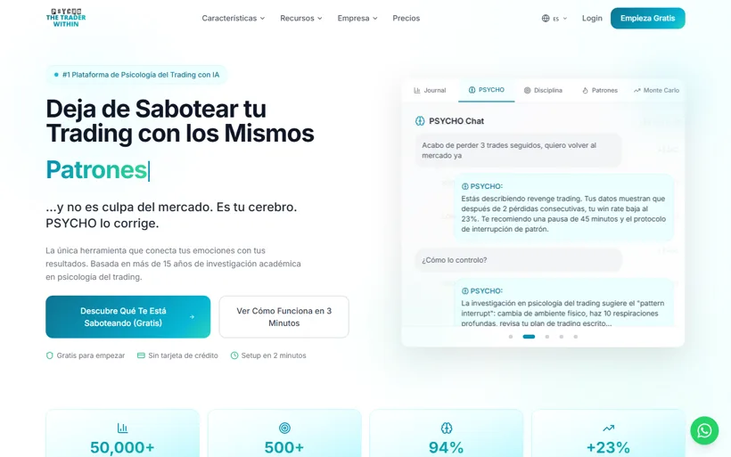</a> <strong>PSYCHO</strong> · plataforma SaaS</td>
<td align="center" width="25%">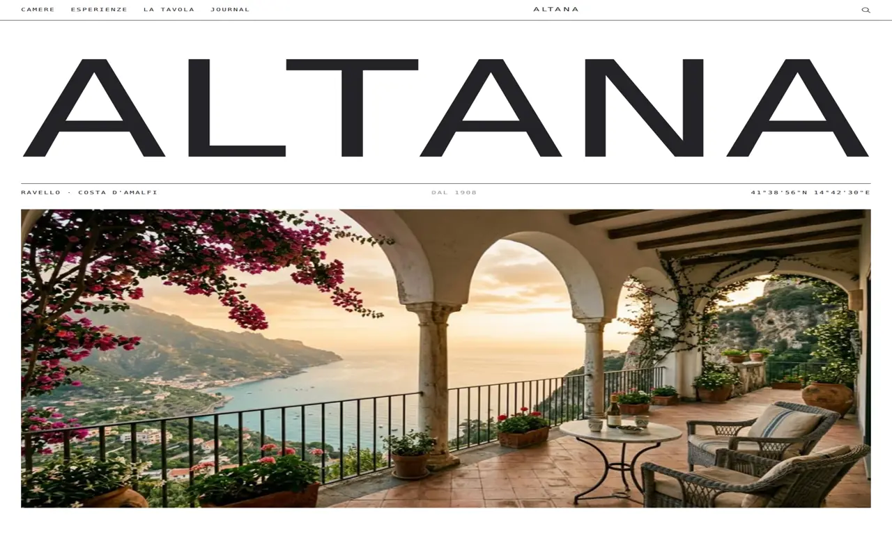 <strong>Altana</strong> · hotel &amp; hospitalidad</td>
<td align="center" width="25%">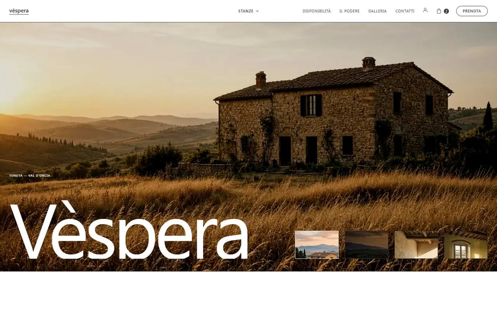 <strong>Tenuta Véspera</strong> · hospitalidad</td>
</tr>
<tr>
<td align="center" width="25%">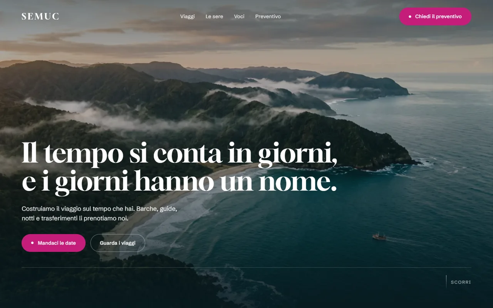 <strong>Semuc</strong> · agencia de viajes</td>
<td align="center" width="25%">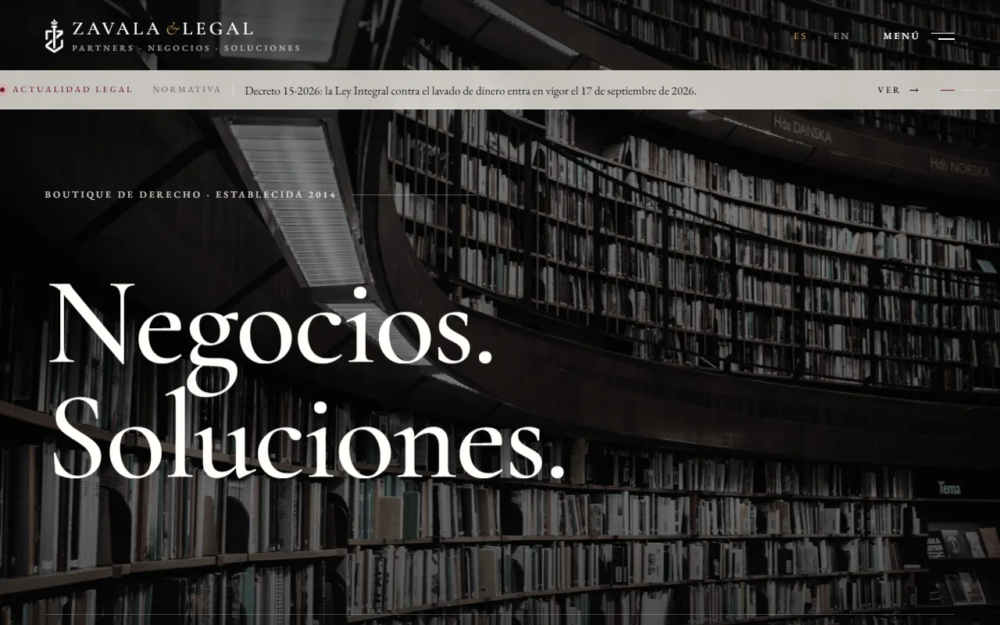 <strong>Zavala &amp; Legal</strong> · legal · corporativo</td>
<td align="center" width="25%"><a href="https://agentemia.it/landing-page/ciak/">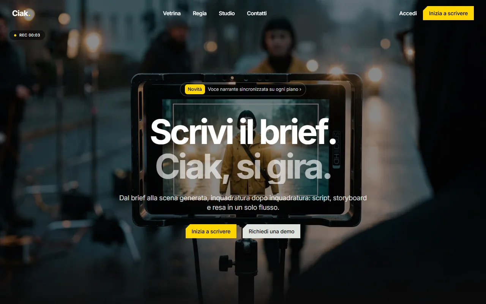</a> <strong>CIAK</strong> · video IA</td>
<td align="center" width="25%">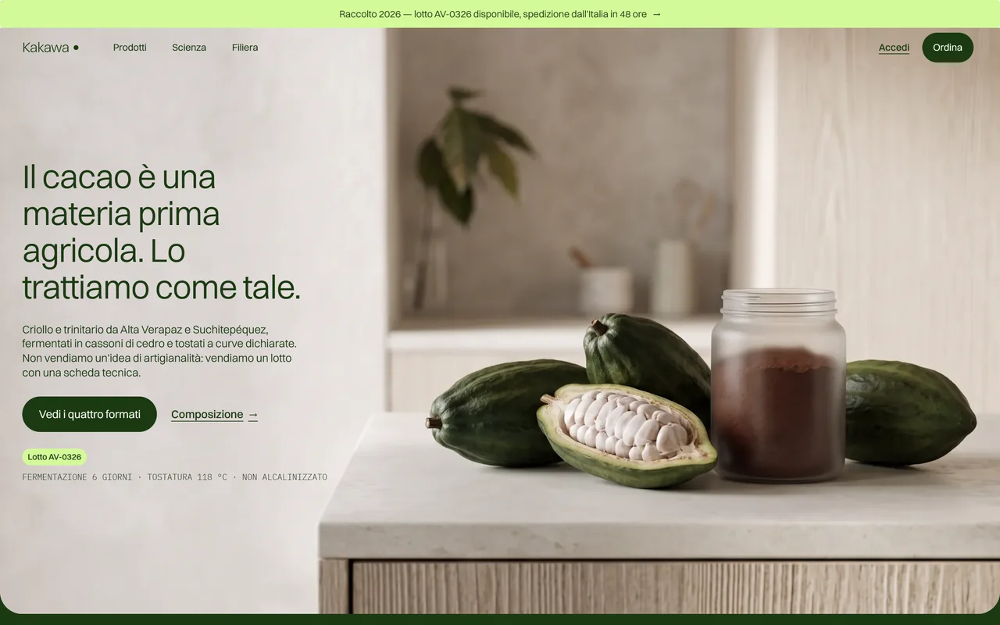 <strong>Kakawa</strong> · cacao &amp; chocolate</td>
</tr>
<tr>
<td align="center" width="25%">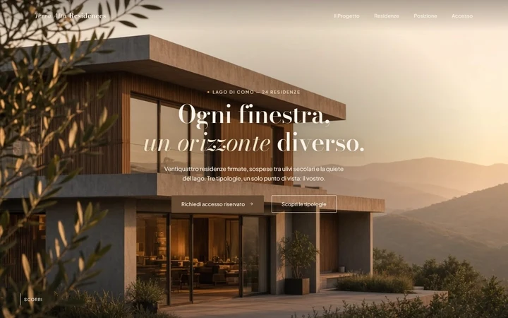 <strong>Terra Alta</strong> · inmobiliaria</td>
<td align="center" width="25%">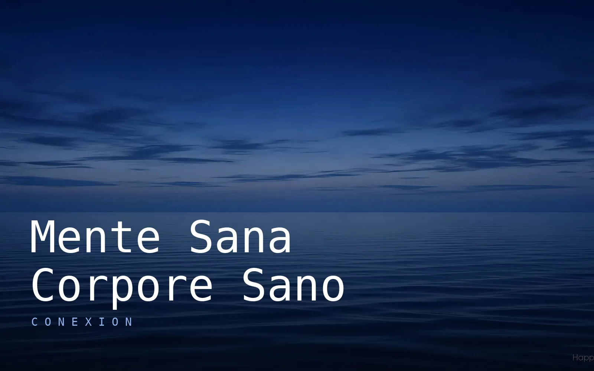 <strong>Conexión</strong> · bienestar &amp; neurociencia</td>
<td align="center" width="25%">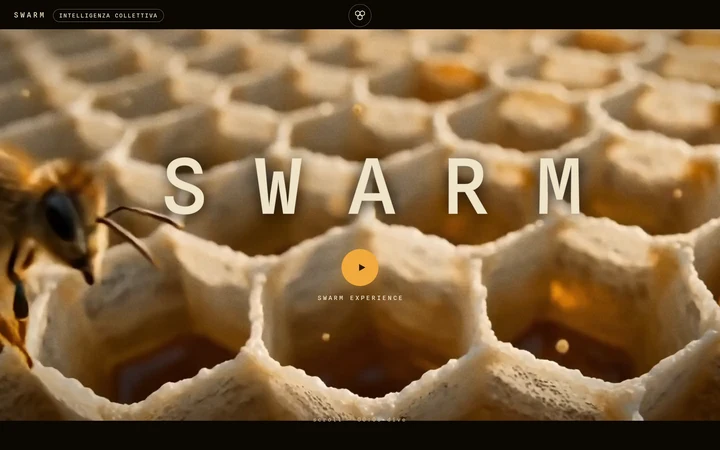 <strong>SWARM</strong> · SaaS &amp; IA</td>
<td align="center" width="25%"> <strong>Nerea</strong> · energía</td>
</tr>
</table>

Todo el portafolio, navegable: <a href="https://presencia.lat/#webapps">presencia.lat</a>

---

## En acción

No vendemos promesas: te mostramos el producto. Tres servicios distintos, tres piezas producidas en casa con IA
— brief → storyboard → render, sin agencia externa.

**02 · Front-office — recuperación de ventas.** Lo que pasa cuando nadie contesta, y lo que pasa cuando contesta el equipo (6 s):

https://github.com/user-attachments/assets/97f3e627-df46-4be3-b216-bcf589e52066

**03 · Redes sociales — contenido que publicamos.** Reel generado con avatar IA para un cliente, formato vertical listo para Instagram y TikTok:

https://github.com/user-attachments/assets/51a7d621-1f6d-48ae-a470-d73d4fb5e59a

**Fundadores y directivos.** El equipo de IA atendiendo mientras tú diriges (6 s):

https://github.com/user-attachments/assets/2473eb99-4139-4e08-bce7-269fdabac1a8

---

## Precios — claros, en quetzales, cancela cuando quieras

Elige por dónde empezar. Luego, tres niveles. El **Front-office** junta chat con tu marca en el sitio,
agente telefónico en tu propio número y página web a tu medida, en un solo pago. Con el anual ahorras **17 %**.

### Front-office — todo junto, un solo pago

| Plan | Mensual | Con el anual | Voz incluida | Dimensión |
|---|---|---|---|---|
| **Front-office Base** | Q1,500/mes | Q1,250/mes | 300 minutos | ~100 llamadas de 3 min al mes |
| **Front-office Pro** · más elegido | Q2,750/mes | Q2,300/mes | 650 minutos | ~215 llamadas de 3 min al mes |
| **Front-office Premium** | Q5,900/mes | Q4,900/mes | 1,200 minutos | ~400 llamadas de 3 min al mes |

Cada plan incluye la chat con tu marca (plan Equipo IA correspondiente), el agente telefónico en tu número y la
página web a tu medida (realización desde Q5,400). Minutos extra: Q1.85 por minuto, facturación al segundo.

### Por piezas

| Pieza | Desde | Nota |
|---|---|---|
| **Chat en el sitio** | Q800/mes | Base Q800 · Pro Q2,050 · Premium Q5,800. Misma bandeja de la consola. |
| **Agente telefónico** | Q550/mes | 300 min Q550 · 650 min Q670 · 1,200 min según plan. Responde en tu propio número, festivos incluidos. |
| **Servicios individuales** | Q700/mes | Página web, SEO · AEO, integraciones a medida. |

**En todo:** activación Q0, sin permanencia, sin penalidades. Cancelas cuando quieras y te llevas tus datos.

---

## Cómo empezamos

| Fase | Qué pasa |
|---|---|
| **1 · Diagnóstico** | Una llamada de 30 minutos, sin compromiso: entendemos tu negocio, tus canales y dónde pierdes clientes. |
| **2 · Construcción** | Web bilingüe, base de conocimiento con tus documentos, agentes verticalizados en tu sector. |
| **3 · Puesta en marcha** | Una línea de código en tu sitio, número telefónico activo. Antes del go-live, prueba de estrés en 15 escenarios críticos de tu sector. |
| **4 · Operación** | El equipo trabaja 24/7. Tú miras la consola. |

---

## Preguntas frecuentes

**¿En cuántos idiomas atienden los agentes?** 110, de forma nativa. Reconocen el idioma de quien escribe y responden en el mismo.

**¿Tengo que cambiar mi sitio?** No. Una línea de código, ningún cambio en tu página. Si aún no tienes web, la hacemos en 7 días.

**¿Y si el agente se equivoca?** Antes de cada go-live: prueba de estrés en 15 escenarios críticos de tu sector. Si no sabe, dice «no lo sé» y pasa a un humano. Nunca inventa.

**¿Puedo probarlo sin compromiso?** Sí: diagnóstico gratuito de 30 minutos por WhatsApp o videollamada.

---

  
  

### Este repositorio

Vitrina pública de la marca: sin código, sin infraestructura interna, sin secretos. Solo posicionamiento, producto
y precios — los mismos de [presencia.lat](https://presencia.lat). Marca hermana: [agentemIA](https://github.com/MGEncrypted/agentemia) (Italia).

  <strong>presencIA</strong> — Velocidad · Verticalidad · Verdad 
  Agencia digital con IA · Lago de Atitlán · una empresa de Intuit AI

